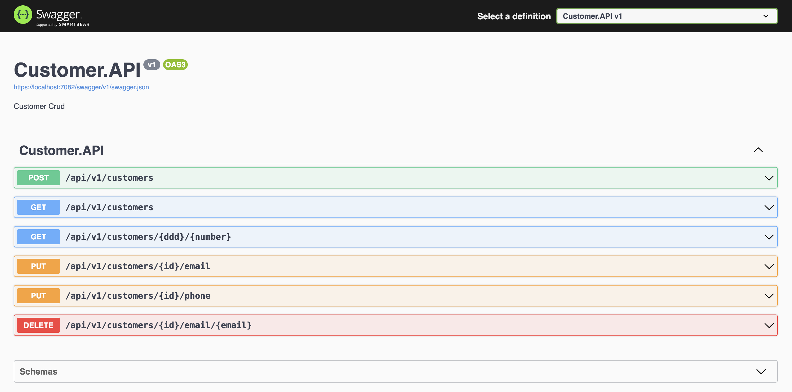

# Desafio
O seu objetivo é construir uma WebApi desenvolvida em .net 6.0 para efetuar o registro de clientes que deverão informar o nome completo, e-mail e uma lista de telefones para receber informações.

Para isso você deverá aplicar o conceito de CRUD:


- a. Create;
- b. Read;
- c. Update;
- d. Delete.

Você deverá entregar uma WebApi que tenha as seguintes funções:

- [x] Cadastrar o cliente informando o nome completo, e-mail e uma lista de telefones informando o DDD, número e o tipo [fixo ou celular];
- [x] Permitir consultar todos os clientes com seus respectivos e-mails e telefones;
- [x] Permitir a consulta de um cliente através do DDD e número;
- [x] Permitir a atualização do e-mail do cliente cadastrado;
- [x] Permitir a atualização do telefone do cliente cadastrado;
- [x] Permitir a exclusão de um cliente através do e-mail.

# Requisitos técnicos:

- 1 - Desenvolver em .Net 6.0;
- 2 - Utilizar base de dados local;
- 3 - Criar testes de unidade;
- 4 - Documentar a WebApi via Swagger.


# Rodando o Back End (servidor)
Antes de começar, você vai precisar ter instalado em sua máquina as seguintes ferramentas:
[.NET 6](https://git-scm.com). 
Além disto é bom ter um editor para trabalhar com o código como [VSCode](https://code.visualstudio.com/), [Rider](https://www.jetbrains.com/pt-br/rider/), [VisualStudio](https://visualstudio.microsoft.com/pt-br/)


```bash
# Clone este repositório
$ git clone <https://github.com/ramirescm/customer-api>

# Acesse a pasta do projeto no terminal/cmd
$ cd customer-api

# Restaure os pacotes
$ dotnet restore

# Execute a aplicação
$ dotnet run --project src/Customer.API

# O servidor inciará na porta:7082 - acesse <https://localhost:7082/swagger/index.html>
```

  

- Em caso de dúvida, importar o arquivo customer_api.json no InSominia, 

# Tecnologias
- .NET 6
- REST
- Banco de dados InMemory/Postgres
- Mediator
- Unit of Work (UoW)
- Fluent API

# Docker

```bash
## Runing docker compose
docker-compose -f docker-compose.yml up

## Update database
dotnet ef database update --project src/Customer.Infra --startup-project src/Customer.Api   

## Add Migration
dotnet ef migrations add NewMigration  --project src/Customer.Infra --startup-project src/Customer.Api 

## Initial state database 
dotnet ef database update 0 --project src/Customer.Infra --startup-project src/Customer.Api

## Remove migration
dotnet ef migrations remove --project src/Customer.Infra --startup-project src/Customer.Api
```
### Pré-requisitos

Antes de começar, você vai precisar ter instalado em sua máquina as seguintes ferramentas:
[Git](https://git-scm.com), [Node.js](https://nodejs.org/en/). 
Além disto é bom ter um editor para trabalhar com o código como [VSCode](https://code.visualstudio.com/)

